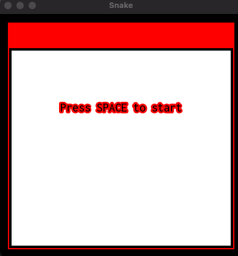
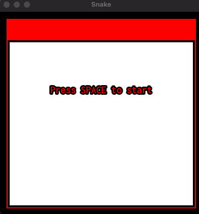
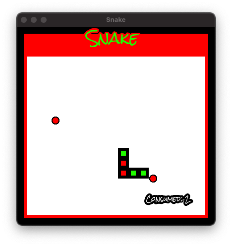
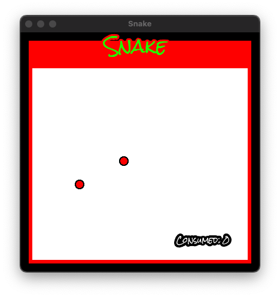
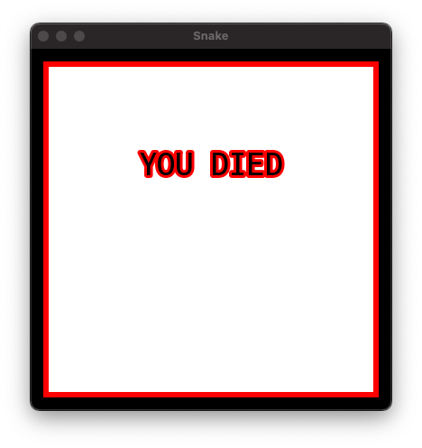

# snake-game

cycle 1:  

 
cycle 2:  

 
Menu cycle animation until game initiated  

Snake animation depends on collision and food consumed. Starting length is three segments. Color of segments depend on the overall length and velocity depends on length after four consumed "snacks".  

On collision death animation.  

 
Future additions: variety in pickups, difficulty settings, unique sprite animations rather than rectangle class, pause menu, reset function, set bounderies.
